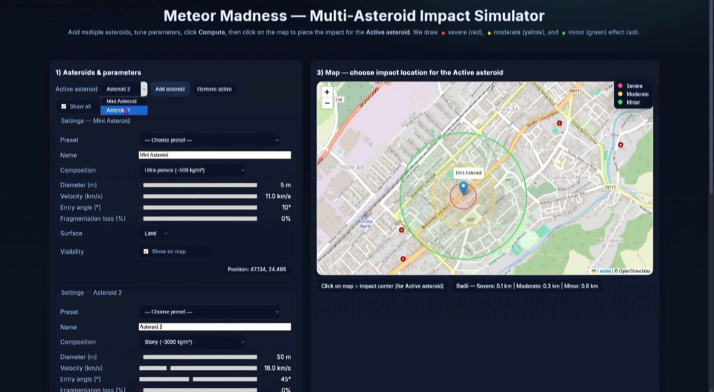

# Meteor Madness | InfotronX

This repository contains the source code for **Meteor Madness — Multi-Asteroid Impact Simulator**, developed by **InfotronX**.

I am publishing it on my GitHub as part of my portfolio, since I was the main contributor to the project and worked on most of the implementation.
The project also reflects team collaboration during the season.

🏆 **Global Nominee** — our team was internationally recognized as a **Global Nominee** in the NASA Space Apps Challenge.

## About the Project

Meteor Madness is an interactive web application focused on asteroid impact simulation, visualization, and educational exploration.

It allows users to add multiple asteroids, modify their physical parameters, compute estimated impact effects, and place impact locations directly on an interactive world map.

The project was designed to provide a dynamic and engaging way to explore asteroid scenarios through front-end web technologies, visual feedback, and interactive controls.

## Main Highlights

- Interactive multi-asteroid impact simulator
- Clickable world map for placing impact locations
- Adjustable asteroid parameters:
  - composition
  - diameter
  - velocity
  - entry angle
  - fragmentation loss
  - impact surface
- Estimated:
  - impact energy
  - TNT equivalent
  - exposed population
  - risk level
- Visual effect radii for:
  - severe impact zone
  - moderate impact zone
  - minor impact zone
- Historical / known asteroid impact presets
- Export simulation as PNG
- Interactive chart-based results display

## Technologies Used

- HTML
- CSS
- JavaScript
- Leaflet
- Chart.js
- html2canvas

## Demo

[Demo Live]()

### Video Presentation (recorded and edited by me)

[Presentation](https://www.youtube.com/watch?v=8UbYHN0Mc7g)

## Recognition

One of the most important achievements of this project was that our team became a **Global Nominee** in the **NASA Space Apps Challenge**.

This distinction reflects the impact, originality, and technical effort behind our work.

[Our Team's Profile](https://www.spaceappschallenge.org/2025/find-a-team/infotronx5/).

## Why this project matters

This project represents more than a simple website.  
It reflects:
- teamwork under competition pressure
- interest in science and planetary impact scenarios
- creative front-end problem solving
- practical web development skills
- educational simulation design

## Project Contents

The repository includes:
- source code files
- styling files
- JavaScript logic
- visual assets
- simulation and interaction components
- map-based visualization
- chart rendering and export functionality

## Notes

This project is an **educational simulation** and uses simplified approximations.  
It is intended for demonstration and learning purposes, not for professional hazard analysis.

## Screenshots

## Creator

Created by **Cristi Gabor** / **InfotronX**  
GitHub: [KiyamaPaD](https://github.com/KiyamaPaD)
